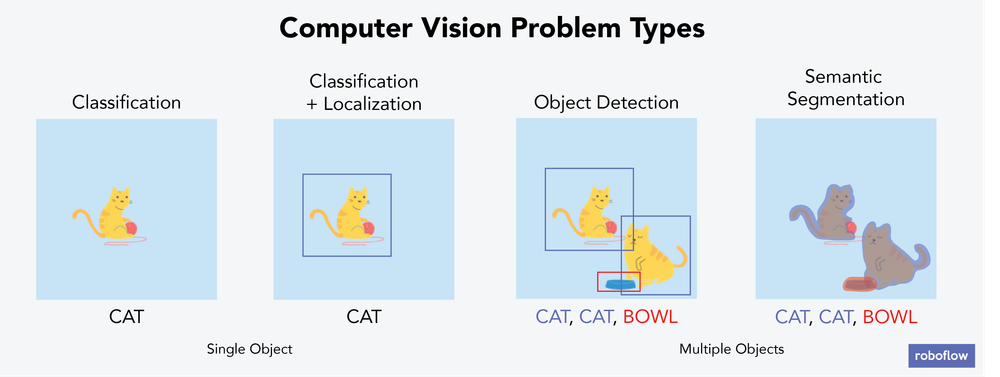
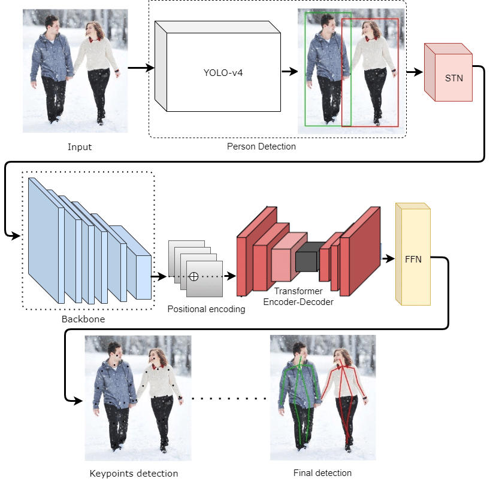

# 
🖥️ ComputerVision 👁️

    
    

## 📋 General instructions

- [About](#-about)
- [Requirements](#-requirements)
- [Usage](#-usage)

## 🔍 About

Computer Vision is a personal discovery project I started to showcase my knowledge of some of its tasks.\
In truth, I already started experimenting with object detection on Android in a private project since the start of January 2025.\
Compared to this first one which uses XML layout and media projection (screen casting) as model input, I wanted to explore Compose layout and camera feed (which is significantly harder to work with because of the high variance in blur, luminosity, rotation and zoom).

## 💻 Requirements

This project isn't really meant to be run on another setup as it requires specifics and I didn't include everything in this repository (Gradle, lib versions...).\
You would need:
- [Android Studio](https://developer.android.com/studio) with adb, sdk, ndk, cmake...
- a phone (doesn't need to be a good one).
- The Minecraft toys I trained my models on, unless you create your own like I did.

## 🎮 Usage

The application simply requires camera then accessibility permissions (camera permission is only for the first time but accessibility is on each launch).\
Once granted, the preview of the camera feed occupies the whole application space, and floating buttons at the top allow you to change between tasks.\
It is also possible to use the front camera with the floating switch button at the bottom left.

# 📋 Tasks

- [Object Detection](#-object-detection)
- [Keypoint Detection](#-keypoint-detection)
- [Instance Segmentation](#-instance-segmentation)
- [Private Project](#-private-project)

## ☐ Object Detection

    

### The context

[Object detection](https://en.wikipedia.org/wiki/Object_detection) is a task that involves identifying the location and class of objects in an image or video stream. The output of an object detector is a set of bounding boxes that enclose the objects in the image, along with class labels and confidence scores for each box.\
In this case, the objects are minecraft goodies (height x width x depth in cm):
- 2 Steves (4x2.5x1 and 15x6x6)
- 2 swords (11.5x5x0.5 and 60x30x1.5)
- 1 dirt block (3.5x3.5x3.5)
- 1 enderman (10x4x0.5)

### The process
The aforementioned camera feed difficulties coupled with having differently looking objects under the same class as well as their shapes (dirt block being 3D where I'd need to anotate many faces and angles compared to swords being 2D so from the side they wouldn't look like a sword at all) made it a very challenging task.\
I had to take many videos to annotate and retrain the model every time.\
This resulted in:
- 14278 images of which 13% are negative samples
- 21720 handmade marks (with the help of previously trained models and mouse macros) so about 5427.5 per class and 1.7 per image
- 15.2GB in disk size (14.2GB in the resize/zoom cache)
- about 10 hours of total training time on my laptop's 3050 (512x288 network size, batch 64, subdivision 4, 6000 iterations)

which were conveniently handled by [Stephane Charette's DarkSuite](https://github.com/stephanecharette) (DarkMark, DarkHelp and darknet).\
The best weights model, about 23MB in size, was then converted to a .bin, optimized and [int8 quantized](https://fr.mathworks.com/company/technical-articles/what-is-int8-quantization-and-why-is-it-popular-for-deep-neural-networks.html) to 5.8MB (along with better performance) thanks to [nihui's NCNN](https://github.com/Tencent/ncnn).\
Inference is executed in JNI (C++ on Android) with adaptable network options (based on GPU availability and phone performance) under a Dispatchers.Default coroutine (for CPU-intensive workloads).\

### What I did wrong
- The videos I took and added to my annotation are all over the place, I didn't really plan on how I should optimally take them so they range from me picking them up 1 by 1 to spinning around with the object.
- This caused a lot of blur which is really annoying to annotate since even myself sometimes couldn't tell if I should "teach" my model to recognize a really blurry object (I knew what it was from context but the goal of my model is to recognize generalistic patterns).
- I also kept 4 different resolutions of videos (of which the frames were extracted) which in itself isn't a problem for the model (as only the network size matters since everything gets resized to it) but makes it hard to find the perfect network resolution off the smallest annotation since it'll always be on the smallest resolution which isn't the only one.
- Out of a belief that if I use previous models to help me annotate images faster, it wouldn't learn (as it'd just use what it knows already), I ended up annotating almost everything by hand which is very inefficient/counterintuitive. In reality the model just makes predictions and it's still up to you to accept/deny/resize them so that it learns from its mistakes through training again.
- I'm still not sure about the right amount of images given a project but I believe 14278 in this case is too much. When extracting frames from the video, you should almost never use all the frames (as in a continuous video one frame will be very similar to the previous one the model will already learn from) but "every X frames" or "X% of random frames".
- That is even more of a problem considering 13% of negative samples in such a complicated setup is way too low, the recommendation is 50% and the ones I did were really bad. The negative samples are supposed to cover the typical environment where the objects would be but without them, so the model knows the objects aren't tied to it (learn what the objects are but also what they aren't).

## 🖐 Keypoint Detection

TODO

## 🧩 Instance Segmentation

TODO

## 🚫 Private Project

    

On top of what's mentioned in [About](#-about), the project features:
- networking c++ integration with [mongoose](https://github.com/cesanta/mongoose)
- which handles both Supabase and discord webhook POST on https with TLS and parsing
- aes c++ encryption with [tiny aes](https://github.com/kokke/tiny-AES-c) and other code obfuscation techniques (hash check, compilation flags, proguard...)
- an extensible architecture allowing easy addition of new models and their process code, the connect4 one is an example to which I plugged [Pascal Pons' connect4 solver](https://github.com/PascalPons/connect4)
- an extra floating/movable menu overlay for easy model swapping on the fly
- gestures simulation with either accessibility service or IInputManager
- [Shizuku](https://github.com/RikkaApps/Shizuku) integration
- translation into more than 20 languages
- more advanced UI like grids, dialogs, sliders, forms...
- basically a real app