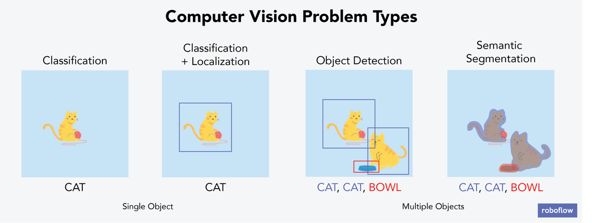
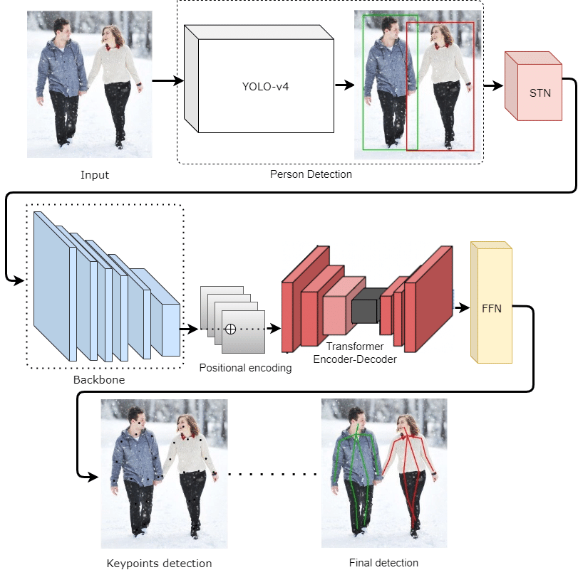
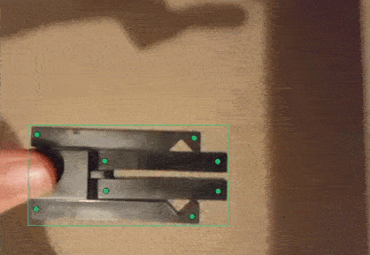
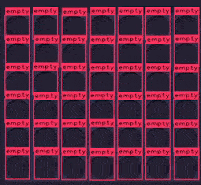

# 
🖥️ ComputerVision 👁️

    
    

## 📋 General instructions

- [About](#-about)
- [Requirements](#-requirements)
- [Usage](#-usage)

## 🔍 About

Computer Vision is a personal discovery project I started to showcase my knowledge of some of its tasks.\
In truth, I already started experimenting with object detection on Android in a private project since the start of January 2025.\
Compared to this first one which uses XML layout and media projection (screen casting) as model input, I wanted to explore Compose layout and camera feed (which is significantly harder to work with because of the high variance in blur, luminosity, rotation and zoom).

## 💻 Requirements

This project isn't really meant to be run on another setup as it requires specifics and I didn't include everything in this repository (Gradle, lib versions...).\
You would need:
- [Android Studio](https://developer.android.com/studio) with adb, sdk, ndk, cmake etc,
- a phone (doesn't need to be a good one),
- The Minecraft toys I trained my models on, unless you create your own like I did.

## 🎮 Usage

The application simply requires camera then accessibility permissions (camera permission is only for the first time but accessibility is on each launch).\
Once granted, the preview of the camera feed occupies the whole application space, and floating buttons at the top allow you to change between tasks.\
It is also possible to use the front camera with the floating switch button at the bottom left.

# 📋 Tasks

- [Object Detection](#-object-detection)
- [Keypoint Detection](#-keypoint-detection)
- [Instance Segmentation](#-instance-segmentation)
- [Private Project](#-private-project)

## ☐ Object Detection

    

### The context

[Object detection](https://en.wikipedia.org/wiki/Object_detection) is a task that involves identifying the location and class of objects in an image or video stream. The output of an object detector is a set of bounding boxes that enclose the objects in the image, along with class labels and confidence scores for each box.\
In this case, the objects are minecraft goodies (height x width x depth in cm):
- 2 Steves (4x2.5x1 and 15x6x6),
- 2 swords (11.5x5x0.5 and 60x30x1.5),
- 1 dirt block (3.5x3.5x3.5),
- 1 enderman (10x4x0.5).

### The process
The aforementioned camera feed difficulties coupled with having differently looking objects under the same class as well as their shapes (dirt block being 3D where I'd need to anotate many faces and angles compared to swords being 2D so from the side they wouldn't look like a sword at all) made it a very challenging task.\
I had to take many videos to annotate and retrain the model every time.\
This resulted in:
- 14278 images of which 13% are negative samples,
- 21720 handmade marks (with the help of previously trained models and mouse macros) so about 5427.5 per class and 1.7 per image,
- 15.2GB in disk size (14.2GB in the resize/zoom cache),
- about 10 hours of total training time on my laptop's 3050 (512x288 network size, batch 64, subdivision 4, 6000 iterations).

which were conveniently handled by [Stephane Charette's DarkSuite](https://github.com/stephanecharette) (DarkMark, DarkHelp and darknet).\
The best weights model, about 23MB in size, was then converted to a .bin, optimized and [int8 quantized](https://fr.mathworks.com/company/technical-articles/what-is-int8-quantization-and-why-is-it-popular-for-deep-neural-networks.html) to 5.8MB (along with better performance) thanks to [nihui's NCNN](https://github.com/Tencent/ncnn).\
There isn't much to say technically as both projects are well maintained and make the conversion really smooth, I only had to change the .param to include a certain confidence thresholding and NMS (Non-Maximum Suppression) which is supported for the Yolov3DetectionOutput layer.\
Inference is executed in JNI (C++ on Android) with adaptable network options (based on GPU availability and phone performance) under a Dispatchers.Default coroutine (for CPU-intensive workloads).\
The result is then carried back to Kotlin where rectangles are drawn with separate colors and their class name as an overlay over the camera output.

You can find in /tools the config file and python scripts I used/made during processes.

### What I did wrong
- The videos I took and added to my annotation are all over the place, I didn't really plan on how I should optimally take them so they range from me picking them up 1 by 1 to spinning around with the object.
- This caused a lot of blur which is really annoying to annotate since even myself sometimes couldn't tell if I should "teach" my model to recognize a really blurry object (I knew what it was from context but the goal of my model is to recognize generalistic patterns).
- I also kept 4 different resolutions of videos (of which the frames were extracted) which in itself isn't a problem for the model (as only the network size matters since everything gets resized to it) but makes it hard to find the perfect network resolution off the smallest annotation since it'll always be on the smallest resolution which isn't the only one.
- Out of a belief that if I use previous models to help me annotate images faster, it wouldn't learn (as it'd just use what it knows already), I ended up annotating almost everything by hand which is very inefficient/counterintuitive. In reality the model just makes predictions and it's still up to you to accept/deny/resize them so that it learns from its mistakes through training again.
- I'm still not sure about the right amount of images given a project but I believe 14278 in this case is too much. When extracting frames from the video, you should almost never use all the frames (as in a continuous video one frame will be very similar to the previous one the model will already learn from) but "every X frames" or "X% of random frames".
- That is even more of a problem considering 13% of negative samples in such a complicated setup is way too low, the recommendation is 50% and the ones I did were really bad. The negative samples are supposed to cover the typical environment where the objects would be but without them, so the model knows the objects aren't tied to it (learn what the objects are but also what they aren't).

## 🖐 Keypoint Detection

    

### The context

[Keypoint/pose detection/estimation](https://en.wikipedia.org/wiki/3D_pose_estimation) is a task that involves locating and classifying specific points of interest within an image or video, outputting their coordinates and confidence scores instead of bounding boxes.\
In this case, the object is the same 10x4x0.5cm enderman toy I used for object detection.
On top of the bounding box surrounding it (since keypoint detection builds off object detection), it was made to detect each of its left and right hands, shoulders, hips and feet.

### The process

Unlike object detection where the DarkSuite handled everything from annotation to inference by way of generating train/val sets and training/evaluating on them, it doesn't yet support keypoints (it will in the future but I thought this would also be a good opportunity to discover other frameworks).\
I therefore chose to follow this [great tutorial](https://www.youtube.com/watch?v=gA5N54IO1ko) by:
- annotating both the train and val data with the popular [CVAT](https://www.cvat.ai/) online tool,
- converting the CVAT annotations to a valid yolov8 pose one,
- setting up the folder architecture and yolo's config yaml file,
- training then validating the model,
- exporting it to ncnn's bin and param.

The next step was to make it work with my android application's JNI NCNN, which it supports, but unlike object detection doesn't simply output the highest confidence bounding box with the associated class.\
Instead it returns the raw feature tensor from the model’s last layer, which represents dense predictions for every grid cell across all FPN (Feature Pyramid Network) levels:
| Level | Stride | Feature Map Size (640×640 input divided by stride) | Detects        |
| ----- | ------ | -------------------------------------------------- | -------------- |
| P3    | 8      | 80 × 80                                            | small objects  |
| P4    | 16     | 40 × 40                                            | medium objects |
| P5    | 32     | 20 × 20                                            | large objects  |

When you concatenate all predictions you then get (80×80) + (40×40) + (20×20) = 8400 total positions.

Each grid cell (or "anchor point") predicts:
- 1 float → object prediction confidence,
- 4 floats → bounding box regression offsets (x, y, w, h) relative to the image size,
- K × 2 floats → keypoints (x, y).
So, for an 8 keypoints model, each grid cell produces 1 + 4 + (8×2) = 21 floats.

The raw NCNN output is therefore [21, 8400] which must then be postprocessed manually, because NCNN for keypoints doesn’t automatically perform:
- Confidence thresholding: keep only predictions with confidence > threshold.
- NMS: remove overlapping boxes based on IoU (Intersection over Union).
- Decoding coordinates: the model predicts values relative to grid positions and strides; these need to be rescaled to pixel coordinates in the 640x640 input image.
- Extracting keypoints: for each retained detection, read the subsequent (x, y) pairs for all keypoints and rescale them to pixel coordinates in the original 640×480 ImageProxy camera output.

Just like for object detection, we then draw them back in Kotlin as an overlay, but this time with colored points instead of a rectangle + class name.

### What I did wrong-ish

- Even though I knew I would have to handle switching models gracefully (making sure there isn't an ongoing inference as we unload it) between tasks, I started with a hardcoded way for object detection (but implementing that part turned out not to be that hard).
- There may have been an easier alternative framework for keypoint annotation/training/inference, but in retrospect I think it's good to handle everything at the lowest level so you truly understand what you're doing.
- Annotating keypoints requires to do it in the same order on every frame since it goes as far as detecting which points are right or left (as we also need to specify what indices get swapped during flipping), mine was [near shoulder 0, near hip 1, far hip 2, far shoulder 3, near hand 4, near foot 5, far foot 6, far hand 7] and I'm not sure I always got the near/far right but considering both sides of the enderman look the same and I still followed the order it should be fine.
- Since Ultralytics training requires a square input, I opted for a 640×640 letterboxed aspect ratio for my 640×480 phone-captured video frames to avoid quality loss from stretching. Because the annotations had already been completed, I implemented a script to apply the letterboxing and update all corresponding annotation coordinates accordingly.

## 🧩 Instance Segmentation

    

### The context

[Semantic segmentation](https://en.wikipedia.org/wiki/Image_segmentation#:~:text=%5Bedit%5D-,Semantic%20segmentation,-is%20an%20approach) is a task that involves assigning a class label to every pixel in an image, producing a mask that corresponds more closely to the shape of an object than a simple bounding box.\
In this case, the object is the same 11.5x5x0.5cm diamond sword toy I used for object detection.\
I initially considered using the Enderman toy, as with keypoint detection, but without its head the silhouette is already fairly rectangular and would not benefit much from segmentation compared to a sword-shaped object.\
On top of the bounding box surrounding it (since semantic segmentation builds on object detection), the model was trained to recover the sword’s shape using 18 contour points.

### The process

As with keypoint detection, DarkSuite does not yet support segmentation, so I followed the same tutorial channel and based my implementation on [this great one](https://www.youtube.com/watch?v=aVKGjzAUHz0). The overall process is identical to [Keypoint Detection](#-keypoint-detection)'s, except that annotation in CVAT consists of defining a pixel-wise mask of the sword shape that yolov8-seg learns.

Recovering the polygon points in my Android app via JNI + NCNN extraction was the most challenging part because, unlike the other tasks, the final *out* Concat layer alone is not sufficient. The model does not directly predict a full-resolution mask per detection; instead, it uses a prototype-based mask representation to keep inference fast and memory-efficient.\
This final tensor contains per-anchor detection data, for each of the 8400 anchors (see why in [Keypoint Detection](#-keypoint-detection)'s process) it includes:
- Bounding box parameters (x, y, w, h)
- Objectness score
- Class scores (if multi-class)
- Mask coefficients (32 weights)

It does not contain spatial mask data, hence why we need to extract another layer from the .param called *proto*.\
The prototype layer is a [32, 160, 160] shared mask basis tensor, produced once per image, where:
- 32 is the number of learned mask prototypes respectively corresponding to *out*'s 32 mask prototypes
- 160×160 is the low-resolution spatial mask grid

The choice of 32 prototypes and a 160 × 160 prototype resolution is an architectural trade-off chosen for the best quality–performance balance.\
If the model predicted a full 160×160 mask per detection, it would require `8400 × 160 × 160 ≈ 215 million values per image` which is infeasible on real-time systems.\
Instead, the model uses linear mask composition with $\mathbf{M}(x,y)=\sigma\!\left(\sum_{i=1}^{32} c_i\,P_i(x,y)\right)$ which reduces the output size to `8400 × 32 + 32 × 160 × 160 ≈ 1 million values per image`.

Since the generated mask is global (160×160 for the entire image), only a small region corresponds to the object and the outside is mostly noise so I crop to remove false positives, improve edge extraction and match how the model was trained.\
Segmentation gives a dense region, not geometry, so we then:
- Sort boundary points into a continuous clockwise shape,
- Reduce unordered edges to 18 of points,
- Rescale and rotate them back to valid screen values into the returned array.

Those points are then drawn in Kotlin as a transparent filled polygon over the sword.

### What I did wrong-ish

- The sword shape was annotated using 18 points, chosen to provide a visually reasonable approximation without excessive precision. However, the predicted mask is not constrained to this limited representation and can capture the sword’s contour with much higher fidelity, potentially involving hundreds of edge points. In practice, rendering all of these points on Android must also be considered, as drawing hundreds of short line segments for the polygon can impact performance.

## 🚫 Private Project

    

On top of what's mentioned in [About](#-about), the project features:
- networking c++ integration with [mongoose](https://github.com/cesanta/mongoose),
- which handles both Supabase and discord webhook POST on https with TLS and parsing,
- secured Supabase PL/pgSQL RPC functions handling accounts, subscriptions and more,
- aes c++ encryption with [tiny aes](https://github.com/kokke/tiny-AES-c) and other code obfuscation techniques (hash check, compilation flags, proguard...),
- an extensible architecture allowing easy addition of new models and their process code, the connect4 one is an example to which I plugged [Pascal Pons' connect4 solver](https://github.com/PascalPons/connect4),
- an extra floating/movable menu overlay for easy model swapping on the fly,
- gestures simulation with either accessibility service or IInputManager,
- [Shizuku](https://github.com/RikkaApps/Shizuku) integration,
- translation into more than 20 languages,
- more advanced UI like grids, dialogs, sliders, forms etc,
- basically a real app.